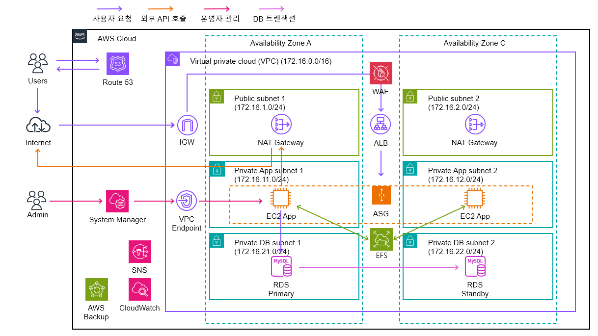
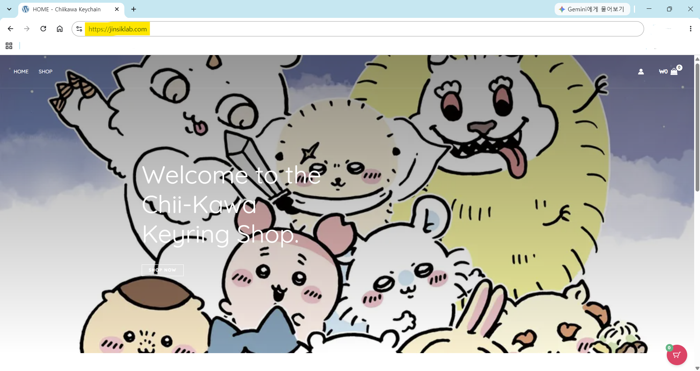
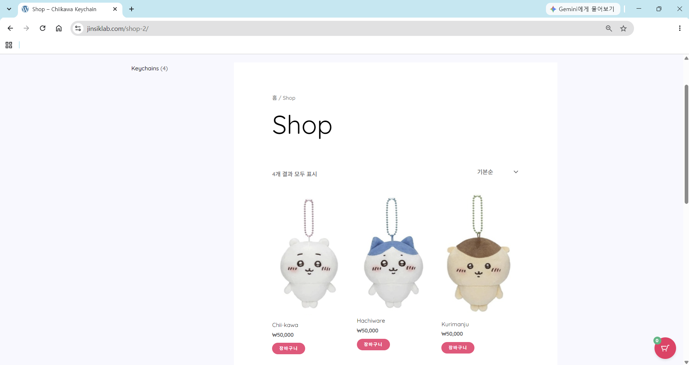
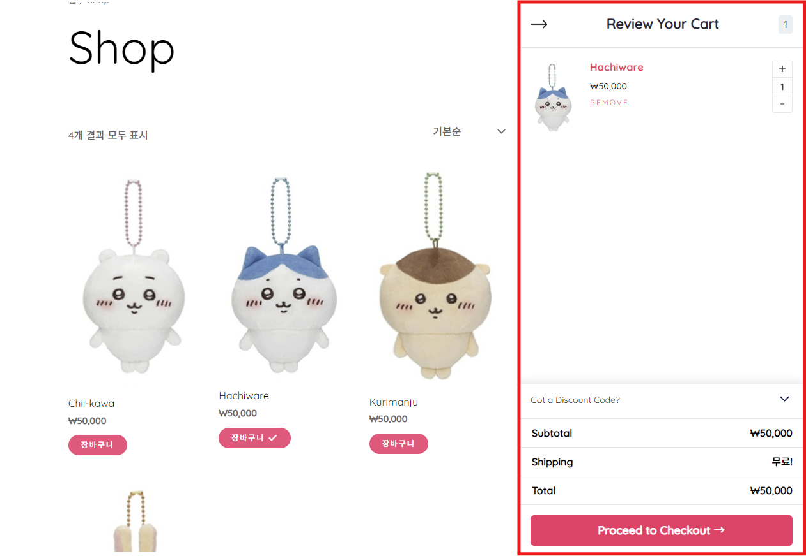
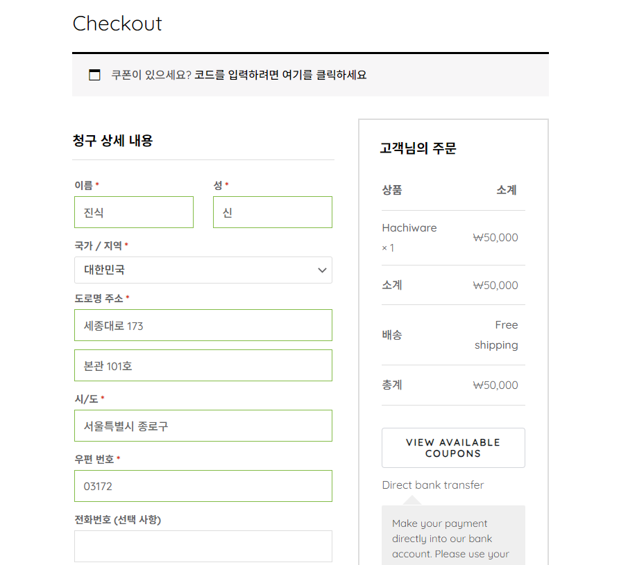
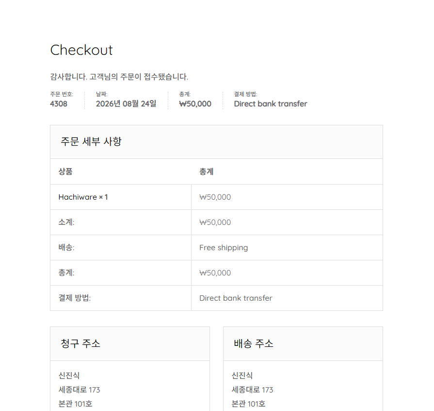
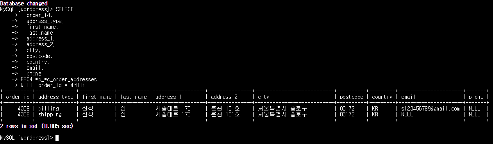

# Terraform을 활용한 AWS 고가용성 WordPress 인프라 구축

> Terraform을 활용하여 AWS 인프라를 코드화하고,  
> 고가용성·보안·운영 효율성을 고려하여 설계한 WordPress 웹 서비스 인프라 프로젝트입니다.

---

## 📌 프로젝트 소개

WordPress 기반 웹 서비스를 AWS 환경에서 안정적으로 운영하는 것을 목표로 설계 및 구축한 개인 프로젝트입니다.

단순히 AWS 리소스를 생성하는 것에 그치지 않고, 실제 서비스 운영 환경을 가정하여 **가용성, 보안, 확장성, 운영 효율성 및 비용**을 종합적으로 고려했습니다.

또한 Terraform을 활용하여 AWS 인프라를 코드화하고, 리소스를 기능별 Module로 분리하여 재사용성과 유지보수성을 높였습니다.

---

## 🎯 프로젝트 목표

- Multi-AZ 기반의 고가용성 인프라 구성
- Auto Scaling을 통한 트래픽 변화 및 인스턴스 장애 대응
- Public / Private Subnet 분리 및 Application / Database 네트워크 영역 분리
- EC2의 SSH 접속을 제거하고 AWS Systems Manager를 활용한 서버 관리
- AWS WAF 및 Security Group을 활용한 접근 제어
- Amazon CloudWatch 및 Amazon SNS 기반 모니터링·알림 체계 구축
- AWS Backup을 활용한 데이터 백업 자동화
- Terraform을 활용한 Infrastructure as Code 구현

---

## 🏗 Architecture



사용자의 요청은 Route 53을 통해 AWS 환경으로 전달되며 AWS WAF에서 웹 요청을 검사한 후 ALB로 전달됩니다.

ALB는 Multi-AZ로 구성된 Auto Scaling Group의 EC2 인스턴스로 요청을 분산하며 정상 상태의 EC2 인스턴스에만 트래픽을 전달합니다.

EC2에서는 Apache, PHP 및 WordPress가 실행되며 WordPress의 데이터베이스는 Amazon RDS for MySQL, 여러 EC2에서 공유해야 하는 파일은 Amazon EFS를 통해 관리합니다.

---

## 🛒 구축한 웹 서비스

구축한 AWS 인프라 위에 WordPress와 WooCommerce를 활용한 온라인 쇼핑몰을 구성하여 실제 서비스 동작을 확인했습니다.

사용자는 Route 53에 등록된 도메인을 통해 HTTPS로 서비스에 접근하며 상품 조회부터 장바구니, Checkout 및 주문 완료까지의 기본적인 쇼핑몰 이용 흐름을 구현했습니다.

### 🏠 메인 페이지



### 🛍️ 상품 조회



### 🛒 장바구니



### 💳 Checkout



### ✅ 주문 완료



### 🗄️ 주문 데이터 저장

생성된 주문 데이터가 Amazon RDS for MySQL에 정상적으로 저장되는 것을 확인했습니다.



---

## 🛠 기술 스택

| Category | Technology |
| --- | --- |
| Cloud | AWS |
| IaC | Terraform |
| Web | WordPress, Apache, PHP |
| Compute | Amazon EC2, Auto Scaling Group |
| Load Balancing | Application Load Balancer |
| Database | Amazon RDS for MySQL |
| Storage | Amazon EFS |
| DNS / Certificate | Amazon Route 53, AWS Certificate Manager |
| Security | AWS WAF, IAM, Security Group |
| Management | AWS Systems Manager |
| Monitoring | Amazon CloudWatch, Amazon SNS |
| Backup | AWS Backup |
| Version Control | Git, GitHub |

---

## ☁️ AWS 인프라 구성

### ■ Network

VPC 내부의 Subnet을 역할에 따라 Public Subnet과 Private Subnet으로 분리했습니다.

인터넷에서 요청을 수신하는 Application Load Balancer는 Public Subnet에 배치하고, 
외부에서 직접 접근할 필요가 없는 EC2와 RDS는 Private Subnet에 배치했습니다.

또한 EC2와 RDS의 네트워크 영역을 분리하여 애플리케이션 영역과 데이터베이스 영역 간 필요한 통신만 허용하도록 구성했습니다.

각 Subnet은 2개의 가용영역에 분산하여 특정 AZ 장애 발생 시에도 서비스를 지속할 수 있도록 설계했습니다.

### ■ Application Load Balancer

인터넷에서 들어오는 HTTP 및 HTTPS 요청을 ALB에서 수신하도록 구성했습니다.

HTTP 요청은 HTTPS로 Redirect하여 모든 사용자 통신이 암호화된 연결을 사용하도록 구성했습니다.

HTTPS 요청은 ALB에서 TLS를 종료하고 내부 EC2 인스턴스로 HTTP 요청을 전달합니다.

또한 Target Group의 Health Check를 통해 정상 상태의 EC2 인스턴스에만 트래픽을 전달하도록 구성했습니다.

### ■ EC2 & Auto Scaling

WordPress의 Application Server는 Amazon EC2 기반으로 구성했습니다.

EC2 인스턴스는 Auto Scaling Group을 통해 2개의 가용영역에 분산 배치하여 특정 인스턴스 또는 AZ 장애 발생 시에도 서비스를 지속할 수 있도록 설계했습니다.

Launch Template을 통해 EC2의 설정을 표준화하고 Auto Scaling Group에서 동일한 설정의 인스턴스를 자동으로 생성할 수 있도록 구성했습니다.

EC2 인스턴스는 외부에서 직접 접근할 수 없도록 Private Subnet에 배치하고 Public IP를 할당하지 않았습니다.

### ■ Amazon RDS

WordPress의 데이터베이스는 Amazon RDS for MySQL을 사용했습니다.

RDS는 외부에서 직접 접근할 수 없도록 Private Subnet에 배치하고, 
Security Group을 통해 WordPress가 실행되는 EC2 인스턴스에서만 MySQL 포트로 접근할 수 있도록 구성했습니다.

또한 RDS Multi-AZ 구성을 적용하여 Primary DB 장애 발생 시 Standby DB로 Failover할 수 있도록 구성했습니다.

### ■ Amazon EFS

Auto Scaling 환경에서는 EC2 인스턴스가 생성 및 교체될 수 있기 때문에 WordPress 파일을 개별 EC2의 Local Storage에만 저장할 경우 여러 인스턴스 간 동일한 파일을 공유하고 유지하기 어렵습니다.

때문에 Amazon EFS를 활용하여 여러 EC2 인스턴스가 WordPress의 공유 파일을 동일하게 사용할 수 있도록 구성했습니다.

### ■ Route 53 & ACM

Amazon Route 53을 이용하여 도메인과 ALB를 연결했습니다.

AWS Certificate Manager에서 SSL/TLS 인증서를 관리하고 ALB의 HTTPS Listener에 인증서를 적용하여 사용자와 ALB 사이의 통신을 암호화했습니다.

### ■ AWS WAF

ALB에 AWS WAF를 연동하여 웹 애플리케이션으로 전달되는 요청을 검사하도록 구성했습니다.

Geo Match 기반의 국가별 접근 제어를 적용하여 일본에서 발생한 요청만 웹 서비스에 접근할 수 있도록 제한했습니다.

또한 WordPress 관리자 페이지(`/wp-admin`)에 대한 접근은 사전에 허용한 관리자 IP로 제한하여 비인가 사용자의 관리자 페이지 접근을 차단했습니다.

### ■ AWS Systems Manager

EC2 관리 목적으로 SSH 포트를 인터넷에 개방하지 않고 AWS Systems Manager Session Manager를 사용하도록 구성했습니다.

이를 통해 Bastion Host 또는 SSH Key를 별도로 관리하지 않고도 Private Subnet의 EC2 인스턴스에 접근할 수 있도록 했습니다.

또한 Systems Manager Parameter Store를 활용하여 WordPress 설정 파일(`wp-config.php`)과 CloudWatch Agent 설정을 중앙에서 관리하도록 구성했습니다.

Auto Scaling으로 새로운 EC2 인스턴스가 생성될 경우 Parameter Store에서 필요한 설정을 가져와 동일한 서버 및 모니터링 환경을 구성할 수 있도록 했습니다.

---

## 🔐 Security

서비스 구성 요소 간 필요한 통신만 허용하도록 Security Group을 계층적으로 구성했습니다.

```text
Internet
   │
   │ HTTPS : 443
   ▼
ALB Security Group
   │
   │ HTTP : 80
   ▼
EC2 Security Group
   │
   │ MySQL : 3306
   ▼
RDS Security Group
```

주요 보안 설계는 다음과 같습니다.

- EC2와 RDS를 Private Subnet에 배치하여 외부에서의 직접 접근 차단
- Security Group을 활용하여 서비스 간 필요한 통신만 허용
- Systems Manager Session Manager를 통한 EC2 관리
- HTTPS 및 AWS WAF를 활용한 외부 요청 보호 및 접근 제어
- IAM Role을 활용하여 AWS 서비스 간 필요한 접근 권한 관리

---

## 📊 Monitoring & Notification

소규모 운영 인력으로도 서비스의 이상 상태를 신속하게 파악하고 대응할 수 있도록 Amazon CloudWatch와 Amazon SNS를 활용한 모니터링 및 알림 체계를 구성했습니다.

### ■ EC2

- CPU 사용률
- 메모리 사용률
- 디스크 사용률
- Apache 및 시스템 로그

메모리 및 디스크와 같은 OS 수준의 지표와 로그는 CloudWatch Agent를 통해 수집하도록 구성했습니다.

### ■ RDS

- CPU 사용률
- 메모리 사용률
- 디스크 사용률
- 에러 로그

CloudWatch Metric Math를 활용하여 메모리와 디스크 상태를 백분율 형태로 확인할 수 있도록 구성했습니다.

### ■ Application Load Balancer

- HealthyHostCount
- HTTPCode_Target_5XX_Count

### ■ AWS WAF

- BlockedRequests

각 CloudWatch Alarm은 Amazon SNS와 연동하여 이상 상태가 감지되면 운영자에게 알림이 전달되도록 구성했습니다.

```text
AWS Resources
      │
      ▼
CloudWatch Metrics / Logs
      │
      ▼
CloudWatch Alarm
      │
      ▼
Amazon SNS
      │
      ▼
Administrator
```

---

## 💾 Backup

AWS Backup을 활용하여 Amazon EFS의 데이터를 정기적으로 백업하도록 구성했습니다.

Backup Plan을 통해 백업 주기와 보존 기간을 설정하고, 생성된 백업을 Backup Vault에 저장하여 관리하도록 구성했습니다.

---

## 🤖 Infrastructure as Code

AWS 인프라는 Terraform을 활용하여 코드로 관리했습니다.

리소스를 하나의 Terraform 파일에서 관리하는 대신 기능별 Module로 분리하여 코드의 가독성, 재사용성 및 유지보수성을 높였습니다.

```text
terraform/
│
├── modules/
│   ├── acm/
│   ├── alb/
│   ├── cloudwatch/
│   ├── ec2/
│   ├── efs/
│   ├── rds/
│   ├── route53/
│   ├── route53_record/
│   ├── ssm/
│   ├── vpc/
│   ├── waf/
│
├── main.tf
├── variables.tf
```

---

## 🤔 Architecture Design

### Why Multi-AZ?

서비스를 단일 가용영역에 구성할 경우 AZ 장애가 전체 서비스 장애로 이어질 수 있습니다.

때문에 ALB, EC2 Auto Scaling, RDS를 Multi-AZ 기반으로 구성하여 특정 AZ 장애 발생 시에도 서비스를 지속할 수 있도록 설계했습니다.

### Why Auto Scaling?

EC2 인스턴스 장애 발생 시 운영자가 직접 새로운 서버를 생성하는 방식은 복구 시간이 길어질 수 있습니다.

Auto Scaling Group을 사용하여 비정상 인스턴스를 자동으로 교체하고, 트래픽 변화에 따라 필요한 인스턴스 수를 조정할 수 있도록 구성했습니다.

### Why EFS?

Auto Scaling 환경에서는 EC2 인스턴스가 지속적으로 생성 및 삭제될 수 있습니다.

따라서 여러 EC2 인스턴스에서 동일한 WordPress 파일을 사용할 수 있도록 Amazon EFS를 공유 스토리지로 사용했습니다.

### Why Systems Manager instead of SSH?

SSH를 사용하기 위해서는 22번 포트 개방, SSH Key 관리 또는 Bastion Host 등의 추가적인 운영 요소가 필요합니다.

Systems Manager Session Manager를 활용하여 EC2를 외부에 직접 노출하지 않고 Private Subnet에서 안전하게 관리할 수 있도록 구성했습니다.

### Why Terraform Modules?

AWS 리소스가 증가하면서 하나의 Terraform 구성에서 모든 리소스를 관리할 경우 코드가 복잡해지고 유지보수가 어려워질 수 있다고 판단했습니다.

때문에 VPC, ALB, EC2, RDS, EFS 등 AWS 리소스를 기능별 Module로 분리하여 각 구성 요소를 독립적으로 관리하고 재사용할 수 있도록 구성했습니다.

---

## ⚠️ Troubleshooting

### 1. ALB 환경에서 WordPress HTTPS 인식 문제

**문제상황**

HTTPS로 WordPress 관리자 계정에 로그인을 시도했지만 브라우저에서 「안전하지 않은 정보를 제출하려 함」이라는 경고가 발생하고 로그인이 정상적으로 진행되지 않았습니다.

**원인**

사용자는 HTTPS로 접속했지만 SSL/TLS 통신이 ALB에서 종료되고 ALB에서 EC2로는 HTTP로 요청이 전달되었기 때문에 WordPress가 사용자의 요청을 HTTP로 잘못 인식하고 있었습니다.

이로 인해 WordPress가 로그인 요청을 HTTP 기준으로 처리하면서 브라우저에서 보안 경고가 발생했습니다.

**대책**

`wp-config.php`에서 ALB가 전달하는 `X-Forwarded-Proto` Header를 확인하도록 설정하여 WordPress가 최초 요청이 HTTPS였음을 인식하도록 하였습니다.

수정 후 브라우저의 보안 경고가 사라지고 WordPress 관리자 로그인이 정상적으로 동작하는 것을 확인했습니다.

### 2. WordPress 템플릿 적용 중 ALB Health Check 실패     

**문제상황**

WordPress 템플릿을 적용하는 과정에서 ALB Health Check가 실패하고 Auto Scaling Group에 의해 EC2 인스턴스가 교체되면서 WordPress 템플릿 적용이 실패하는 문제가 발생했습니다.

**원인**

`t3.micro`의 제한된 메모리 환경에서 WordPress 템플릿 적용으로
PHP-FPM 프로세스의 메모리 사용량이 증가해 EC2 인스턴스의 메모리 부족이 발생했습니다.

이로 인해 Linux OOM Killer가 PHP-FPM 프로세스를 강제로 종료했고
EC2 인스턴스가 웹 요청을 정상적으로 처리하지 못하게 되면서 ALB Health Check가 실패했습니다.

**대책**

EC2 인스턴스 타입을 `t3.small`로 변경하여 메모리 용량을 확보하고
PHP-FPM의 `pm.max_children` 값을 조정하여 메모리 사용량을 제어함으로써 Linux OOM Killer에 의한 프로세스 강제 종료를 방지했습니다.

---

## 📈 프로젝트 성과

- Terraform을 활용한 AWS 인프라 코드화
- 기능별 Terraform Module 구조 설계
- Multi-AZ 기반 고가용성 웹 인프라 구성
- ALB와 Auto Scaling을 활용한 장애 대응 구조 구현
- EFS를 활용한 Auto Scaling 환경의 공유 파일 관리
- AWS WAF 및 Security Group 기반 보안 구성
- CloudWatch 및 SNS 기반 모니터링·알림 자동화

---

## 💡 배운 점

이번 프로젝트를 통해 단순히 AWS 서비스를 구축하는 것보다 **서비스 요구사항에 따라 적절한 AWS 서비스를 선택하고 각 서비스가 어떤 역할을 담당해야 하는지를 설계하는 과정이 중요하다는 것을 경험했습니다.**

특히 Auto Scaling 환경에서는 EC2 인스턴스를 영구적인 서버로 보는 것이 아니라 언제든지 생성되고 교체될 수 있는 리소스로 고려해야 한다는 점을 학습했습니다.

이에 따라 Database는 Amazon RDS, 공유 파일은 Amazon EFS, 서버 설정은 AWS Systems Manager와 같이 EC2 외부의 관리형 서비스로 분리하여 인스턴스 교체에 영향을 최소화하는 방향으로 설계했습니다.

또한 고가용성을 높이는 것뿐만 아니라 보안, 운영 편의성 및 비용 사이의 균형을 고려하는 것이 중요하다는 점을 배웠습니다.

Terraform을 활용한 IaC 구성 과정에서는 리소스를 기능별 Module로 분리함으로써 인프라 코드 역시 구조화와 유지보수성을 고려해야 한다는 점을 경험했습니다.

---